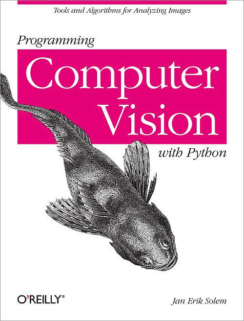

# Programming Computer Vision with Python

### Contents

* chapter1: Basic Image Handling and Processing
* chapter2: Local Image Descriptors
* chapter3: Image to Image Mappings
* chapter4: Camera Models and Augmented Reality
* chapter5: Multiple View Geometry
* chapter6: Clustering Images
* chapter7: Searching Images
* chapter8: Classifying Image Content
* chapter9: Image Segmentation
* chapter10: OpenCV

### Corresponding Material

* [oreilly shop](http://shop.oreilly.com/product/0636920022923.do)
* [example code address](https://github.com/jesolem/PCV)
* [example dataset](http://programmingcomputervision.com/)
* download dataset: `bash get-data-files.sh`

